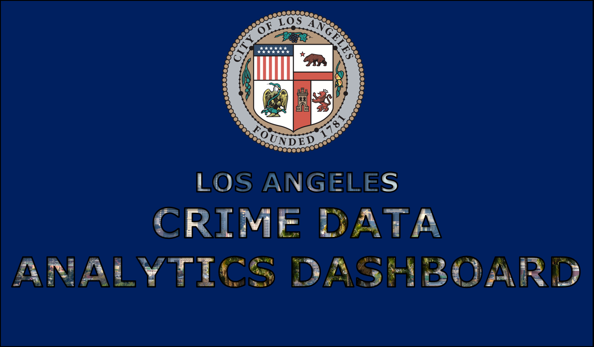
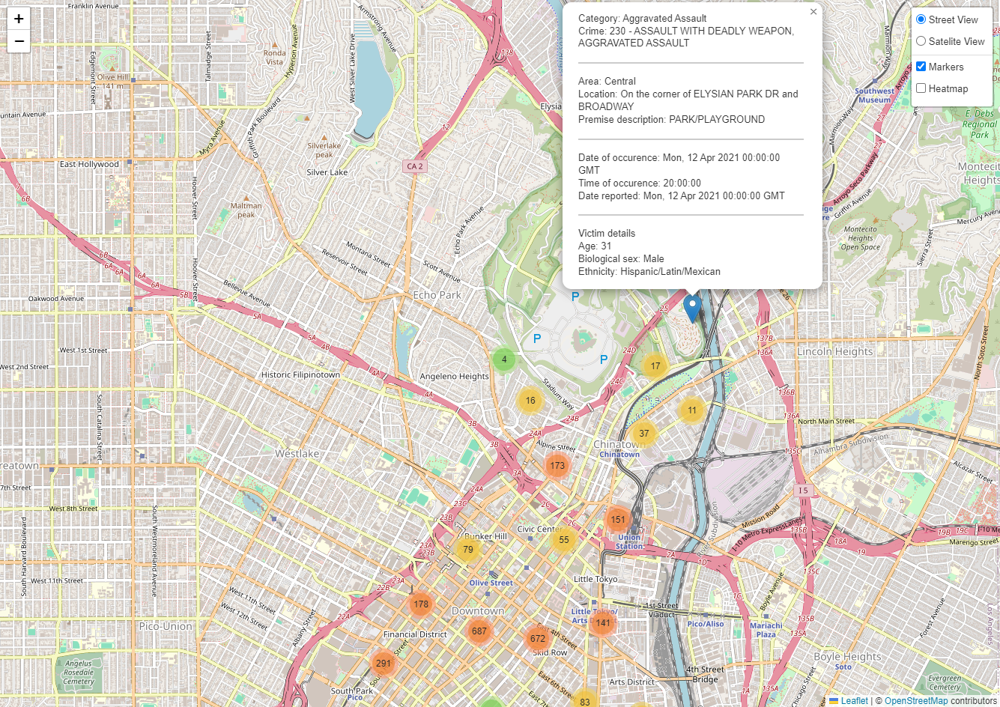
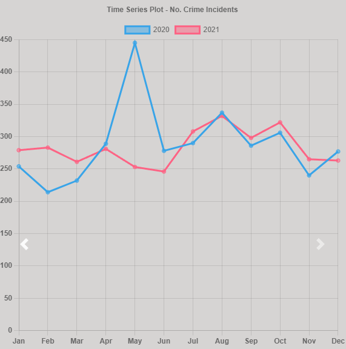
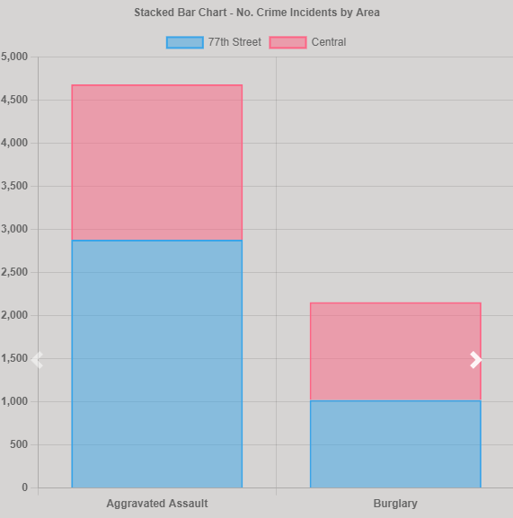
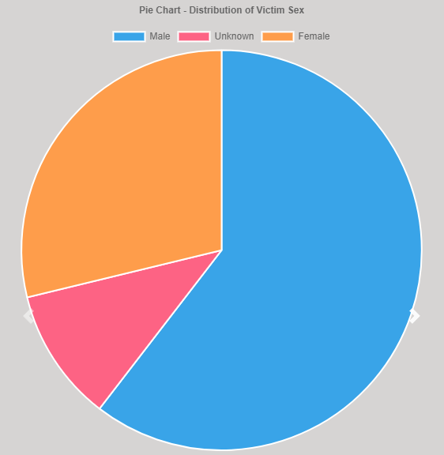
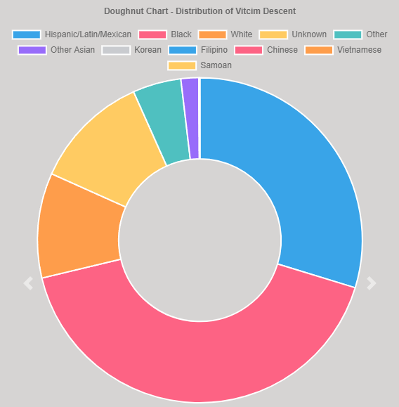

--------------------------------------------------------------------------------------------------------------------------------------------------------------------------
# **Los Angeles: Crime Data Analytics Dashboard**

<p align="center">

</p>

# Table of Contents
1. [Project Members](#project-members)
2. [Project Overview](#project-overview)
3. [Analytics Dashboard (Preview)](#analytics-dashboard-preview)
4. [Contributions](#contributions)
5. [Final Repository Structure](#final-repository-structure)
6. [Crime Dataset Overview](#crime-dataset-overview)
7. [Target Audience](#target-audience)
8. [Interactive Visualisations](#interactive-visualisations)


## Project Members
  * **Nicholas Dale**
    - [Github] https://github.com/falconpunch082
 * **Talieh Sheikholeslami**
    - [Github] https://github.com/Talieh-Sh
 * **Michael Zabala**
    - [Github] https://github.com/michaelz-id
 * **Wassim Deen**
    - [Github] https://github.com/wdeen
  

## Project Overview
For this project, we utilised the [City of Los Angeles' Crime Dataset](https://data.lacity.org/Public-Safety/Crime-Data-from-2020-to-Present/2nrs-mtv8/about_data) to develop an interactive analytics dashboard for general users to accessibly discover patterns and trends of criminal acts taking place within the city.

The publicly available dataset is an official source supplied by the Los Angeles Police Department and is routinely updated. It contains over 850,000 records worth of reported crime incidents in the City of Los Angeles ranging from 2020 and onward.

The following visualisations were developed for the dashboard and references the Crime Dataset:
1. **Interactive Map (Heatmap & Markers)** - Geographically marking locations of crime incidents that have occurred in Los Angeles
2. **Time Series Plot** - No. Crime Incidents by Calendar Year(s)
3. **Stacked Bar Chart** - No. Crime Incidents by Area & Crime Category
4. **Pie Chart** - Distribution of Victim Sex
5. **Doughnut Chart** - Distribution of Ethnic Descent

The following interactive filters were developed for the dashboard:
1. **Dropdown Menu #1** - List of Areas within Los Angeles
2. **Dropdown Menu #2** - List of Crime Categories Occurred within Los Angeles
3. **Double-Handle Slider** - Calendar Years

This project primarily utilised the following technologies to develop the overall dashboard:
1. **HTML + CSS (with assistance from [teleport.io](https://teleporthq.io/))** - Frontend Web Development of Interactive Dashboard
2. **[bootstrap.js](https://getbootstrap.com/) / [bootstrap-multiselect.js](https://github.com/davidstutz/bootstrap-multiselect)** - Interactive Filters (Dropdown Menus / Slider)
3. **Leaflet.js** - Interactive Map Visualisation
4. **Chart.js** - Remaining Interactive Visualisations (Time Series Plot / Stacked Bar Chart / Pie Chart / Doughnut Chart)
5. **D3.js** - Connect with Interactive Elements on Dashboard Webpage
6. **PostgreSQL** - Database to House the Los Angeles Crime Dataset
7. **Pandas** - Data Cleaning & Aggregation
8. **SQLAlchemy** - Connect & Interact with the PostgreSQL Database via Python
9. **Python Flask** - Custom Web Application & API Routes suitable to the project
10. **[Render](https://render.com/)** - API App Hosting via Cloud
11. **[neon.tech](https://neon.tech/)** - SQL Database Hosting via Cloud


## Analytics Dashboard (Preview)

<p align="center">

</p>


## Contributions
  * **Nicholas Dale (falconpunch082)**
    - [Frontend] Full web development of Analytics Dashboard (HTML / CSS)
    - Implementation of input solutions (Bootstrap.js / D3.js).
    - [Data Visualisation #1] Leaflet Map (Leaflet.js)
    - [Miscellaneous] Quality control

   * **Talieh Sheikholeslami (Talieh-Sh)**
     - [Python Flask / SQLAlchemy] Development of Flask API to stream data from PostgreSQL Database for initialisation of JavaScript data visualisations.
     - [Cloud-Based App Hosting] Migration of entire project solution to 'Render' & 'neon.tech' Cloud

   * **Michael Zabala (michaelz-id)**
     - [Python API Calling] Extraction of raw dataset
     - [Python Pandas] Data cleaning + manipulation + export to CSV
     - [PostgreSQL] Database schema design + setup
    
   * **Wassim Deen (wdeen)**
     - [Backend] Full integration of Analytical Dashboard webpage with Python Flask API (local / online)
     - [Frontend] Final polishing to Analytics Dashboard webpage (HTML / CSS)
     - [Miscellaneous] Additional support with PostgreSQL / Python Flask development
     - [Data Visualisation #2] Time Series Plot (Chart.js / D3.js)
     - [Data Visualisation #3] Stacked Bar Chart (Chart.js / D3.js)
     - [Data Visualisation #4] Doughnut Chart (Chart.js / D3.js)
     - [Data Visualisation #5] Pie Chart (Chart.js / D3.js)


## Final Repository Structure
```
├── README.md
├── .gitignore
├── app_render.py
├── 'templates' Folder
├── 'static' Folder
├── 'CrimeSQL' Folder
├── 'Images' Folder
├── 'Slide Deck' Folder
└── '_localhost' Folder
    ├── index.html
    ├── app_local.py
    ├── 'templates' Folder
    └── 'static' Folder
```

--------------------------------------------------------------------------------------------------------------------------------------------------------------------------
## Crime Dataset Overview

Upon interacting with the Render API's dynamic query, a JSON file will be generated. The following is a breakdown of what is provided.

```
{
  "years": [...], // Queried year range
  "area_names": [...], // Queried selection of areas
  "crime_categories": [...], //Queried selection of crimes
  "crime_data": [ // All crime datasets that fit the criteria are listed below
    {
      "id": ..., // Index number of dataset
      "dr_no": ..., // Division number
      "date_rptd": ..., // Date when crime was reported (ignore timestamp)
      "date_occ": ..., // Date when crime occured (ignore timestamp)
      "time_occ": ..., // Time when crime occured
      "area_name": ..., // Area where crime occured*
      "crime_category": ..., // Category of crime according to specific crime*
      "crm_cd": ..., // Crime code according to LAPD policy*
      "crm_cd_desc": ..., // Specific crime done, named according to LAPD policy*
      "vict_age": ..., // Age of victim
      "vict_sex": ..., // Biological sex of victim*
      "vict_descent": ..., // Ethnicity of victim*
      "premis_desc": ..., // Description of place where crime occured
      "location": ..., // Address of where crime occured
      "cross_street": ..., // If the crime occured near an intersection, this will be filled to indicate other street's name. Otherwise null.
      "lat": ..., // Latitude of location where crime happened
      "lon": ..., // Longitde of location where crime happened
    },
    {
      ...
    }
  ]
}

// * -> refer to data_cleanup.ipynb for clarification
```

## Target Audience

This interactive dashboard is designed to cater to 3 main target audiences.

1. The Los Angeles Police Department - Given that we have utilised their raw dataset and not only modified it, but also provided data visualisations, it is hoped that
this interactive dashboard can benefit the police department in multitudes of ways. For example, upon identifying crime hotspots using the map, more patrol routes can
be made to cover those hotspots to reduce crime in the area. Another example would be identifying months where frequency of crime increases and therefore putting more
resources into patrolling during those months.

2. Los Angeles policymakers - While the police department can use the dashboard to intervene crime, policymakers of the city can use the visusalisations to create policies that aim to reduce the likelihood of crime occuring, whether it be by implementing environmental controls (e.g., requesting more surveilance in certain areas), or by creating programs that aim to protect vulnerable people from falling victim to crime. Moreover, policymakers can go through years and cross-reference them to policies made over the years to determine whether a policy was effective in reducing crime rate.

3. Citizens of Los Angeles - The raw dataset is publically available for use, and so it made sense that a tool be made for the citizens of Los Angeles to understand the data without technical expertise. From this visualisation, citizens can be more informed of their surroundings, and therefore take steps to ensure their safety.

## Interactive Visualisations

### **#1 - Leaflet Map (Markers & Heatmap)**

<p align="center">
  
</p>

> This Leaflet map allows the user to visualise the location of crimes in a geological sense. In addition to providing where a crime occurred on the map, clicking the marker provides details on the crime. Crimes that occur close to each other are automatically clustered. In addition, the user can choose to enable a heatmap, which allows them to immediately identify crime hotspots. Moreover, users can switch between street view and satelite view to provide more context.

### **#2 - Time Series Plot**

<p align="center">
  
</p>

> This time series plots updates upon user query, and displays the frequency of crime over months of a year within a year range. Each year is represented as a line chart which shows how many crimes happened within a month of the year. These lines can be disabled and re-enabled by clicking on the coloured boxes.

### **#3 - Stacked Bar Chart**

<p align="center">
  
</p>

> This stacked bar chart aims to provide not only a comparison of the frequency of a specific crime based on the queried data, but also a comparison of the frequency of crime within a specific area. In this example, the user can understand that given a query, aggravated assault is more prevalent than burglary. The user can also see the distribution of aggravated assault between the areas of 77th Street and Central (77th Street has more assault crimes reported than Central).

### **#4 - Pie Chart**

<p align="center">
  
</p>

> This pie chart displays the distribution of the biological sex of the victims affected in the crimes queried. It is divided into three categories: male, female and unknown. Each biological sex can be removed by clicking on the coloured boxes; removing them will update the pie chart to represent the selected sexes.

### **#5 - Doughnut Chart**

<p align="center">
  
</p>

> This doughnut chart displays the distribution of the ethnicity of the victim. Each unique ethnicity is automatically determined according to the query provided. Like the pie chart, each ethnicity can be removed by clicking on the coloured boxes; removing them will update the pie chart to represent the selected ethnicities.

---

**Launch**

There is no need for installation to view this project. Everything is hosted online thanks to Render.
The link to the interactive dashboard is available on the repo's description. Otherwise, you can click this link [here](https://la-crime-project.onrender.com/frontend) to access it.
To access the API that contains our modified database, please click the link [here](https://la-crime-project.onrender.com/). Alternatively, the link to the API is provided during the visualisation's startup.
This repo also contains the necessary files to run the visualisation and database locally. Installation is necessary to host the visualisation through localhost.

---

**App Server Setup (Local/Cloud)**  
+ Add DB Password  
    You need to create dbpassword.txt in the project working directory and paste your database password there.  
    Note: make sure to NOT commit this file to Git.
+ (Once Only) Add New Virtual Environment
    * Open a new terminal and change directory to project working directory
    * Run below command in your project working directory  
      * On macOS and Linux:  
       ``` python3 -m venv .venv```
      * On Windows:   
       ``` python -m venv .venv```
+ Activate the virtual environment  
    * Run below command in your project working directory
      * On macOS and Linux:  
       ``` source .venv/bin/activate```
      * On Windows:   
      ``` .venv\Scripts\activate```
    * Verify Python is correctly configured.
      Run below command, it should shows path to your .venv directory
      ``` which python```  
+ Install Required Python Packages 
    * Run below command in your project working directory  
    ``` pip install -r requirements.txt```


 


 

